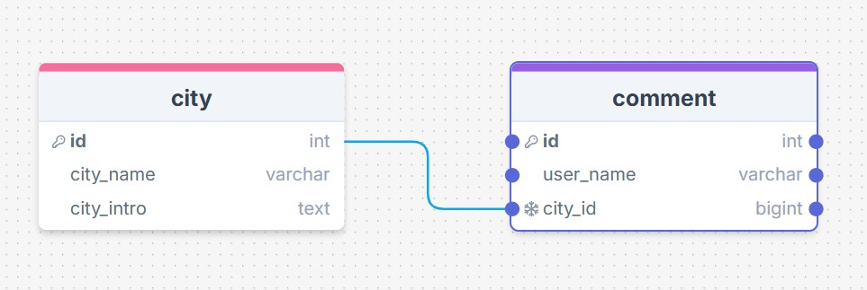
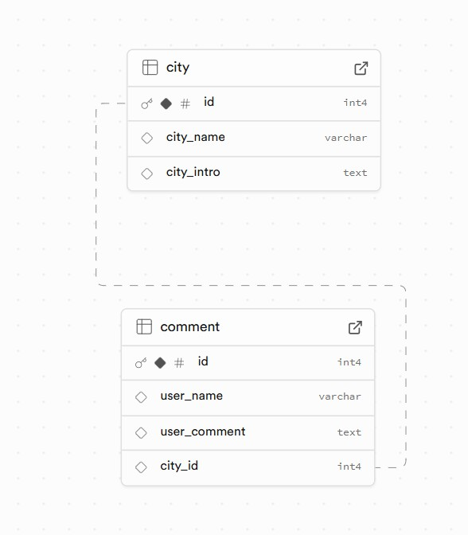
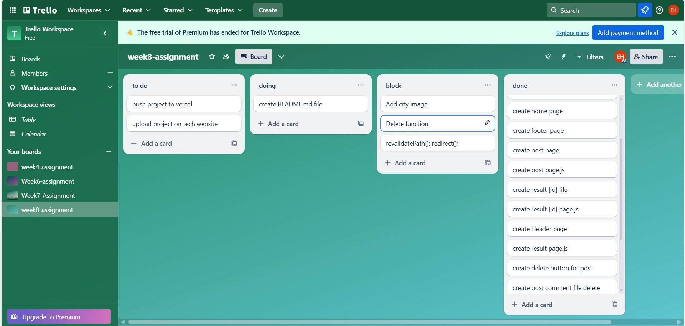

Project name: My City Blog

Vercel link: 

Repo link: https://github.com/eminehorozoglu/week8-Assignment

Project description:

It is a program where you can get information about some cities and comment on them.

You can access the links of the cities from the Posts page. From here, you will be directed to the page where you can find information about the city you want. On this page, you can access information about the city, comment on the city and read the comments made. You can also delete any comment you want.Posts page city names are listed from largest to smallest.The comments under cities are listed from newest to oldest.

The page where all the posts are located is the All Posts page. Here, you can see the comments of all cities and delete any comment you want.All Posts, city names are listed from largest to smallest and comments are listed from newest to oldest.

Database schema:

Databese on Supabase: 

My Project Plan :

Reflections:

1- I tried and applied the sql query on supabase to save the comments under the city to the correct page.

2- I used the param value to save the comments under the correct city.
At first, I could not provide a link to the cities on the Posts page. I was able to connect to the page using the code href={`/result/${data.id}`}>.

3- It was difficult to create a function for the delete button. I created a function inside the button and applied the delete command.

4- I had difficulty in bringing the pictures and information pages of the cities to the relevant city and I solved the problem by using Array.

5- Since I could not find how to bring the [id] on the result page to the page with revalidatePath() and redirect(), I had to redirect to the All Posts page.

6- I used both tailwind and module.css to style the pages.
